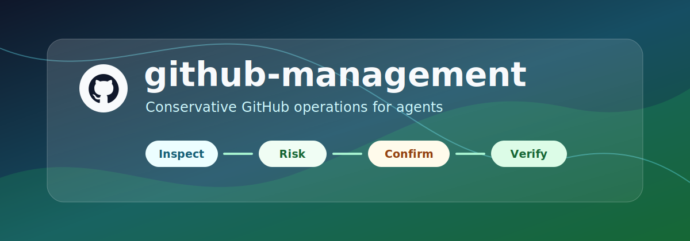
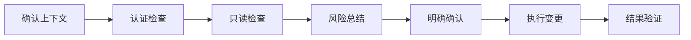

<p align="center">
  <a href="README.md">English</a>
  <span>&nbsp;|&nbsp;</span>
  <a href="README-CN.md"><strong>中文</strong></a>
</p>

<p align="center">
  
</p>

# github-management

`github-management` 是一个面向 Codex 的 GitHub 仓库管理技能包，用于让 AI 编码代理更稳妥地处理 GitHub 认证、仓库检查、PR、Issue、CI、Release 和安全审计相关任务。

这个仓库主要是 **agent skill package**。其中的 Python 脚本是确定性的辅助工具，核心入口仍然是 `SKILL.md` 中定义的技能触发规则和工作流程。

## 适用场景

- 配置和检查 GitHub `gh` CLI 认证状态。
- 只读检查 PR、Review 评论、检查项和 CI 状态。
- 进行 Issue 分流、Release 检查和仓库卫生审计。
- 执行安全最佳实践 review、威胁建模和 ownership map 分析。
- 在任何 GitHub 写操作前收集事实、总结风险并要求明确确认。

## 核心流程



## 快速开始

```powershell
git clone https://github.com/Eriemon/github-management.git
cd github-management
```

查看辅助脚本：

```powershell
python .\scripts\inspect_pr.py --help
python .\scripts\inspect_ci.py --help
python .\scripts\repo_audit.py --help
python .\scripts\triage_issues.py --help
```

本地配置认证。不要把 token 粘贴到聊天、Issue、提交或日志中：

```powershell
Copy-Item .\config\auth.example.json .\config\auth.local.json
$secureToken = Read-Host "Paste token" -AsSecureString
$tokenPtr = [Runtime.InteropServices.Marshal]::SecureStringToBSTR($secureToken)
try {
    $plainToken = [Runtime.InteropServices.Marshal]::PtrToStringBSTR($tokenPtr)
    Set-Content -NoNewline -Path .\config\token -Value $plainToken
}
finally {
    [Runtime.InteropServices.Marshal]::ZeroFreeBSTR($tokenPtr)
    Remove-Variable secureToken, plainToken -ErrorAction SilentlyContinue
}
gh auth login --with-token < .\config\token
gh auth setup-git
gh auth status
```

## 隐私默认值

仓库只追踪 `config/auth.example.json`。本地凭据和运行中产生的敏感状态必须留在本机。

提交前请确认不要暂存或提交：

- `config/auth.local.json`
- `config/token`
- `config/*.secret.json`
- 日志、临时报表或 ownership map 输出
- 真实 token、私有仓库数据或敏感审计导出

## 技能使用

Codex 技能触发名是 `$github-management`。

代理应优先使用确定性辅助脚本：

```powershell
python .\scripts\inspect_pr.py --repo "." --json
python .\scripts\inspect_ci.py --repo "." --json
python .\scripts\inspect_pr_checks.py --repo "." --json
python .\scripts\fetch_comments.py --repo "." --json
python .\scripts\triage_issues.py --repo "." --json
python .\scripts\repo_audit.py --repo "." --json
```

详细规则见：

- `SKILL.md`
- `references/authentication.md`
- `references/safety-policy.md`
- `references/workflows.md`
- `references/ci-diagnostics.md`
- `references/review-comments.md`

## 许可证

Apache-2.0。详见 `LICENSE`。
