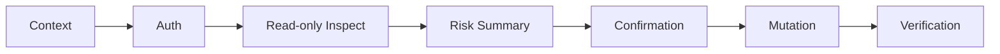

<p align="center">
  <a href="README.md"><strong>English</strong></a>
  <span>&nbsp;|&nbsp;</span>
  <a href="README-CN.md">中文</a>
</p>

<p align="center">
  
</p>

<p align="center">
  <a href="LICENSE"></a>
  <a href="pyproject.toml"></a>
  
  <a href="SKILL.md"></a>
  <a href="references/safety-policy.md"></a>
</p>

<h1 align="center">github-management</h1>

<p align="center">
  A Codex-ready Agent skill for safe, searchable, and reviewable GitHub management workflows.
</p>

`github-management` is an **Agent skill for GitHub management**. It helps Codex and other AI coding agents safely inspect, triage, and operate GitHub repositories through `gh` CLI and GitHub API workflows for pull requests, issues, CI checks, GitHub Actions, releases, repository hygiene, security audits, dependency alerts, and governance tasks.

This repository is primarily a **Codex Agent skill package**. `SKILL.md` defines the agent behavior and safety contract; the Python scripts provide deterministic helper tools for read-only inspection and structured GitHub data collection.

## Why It Exists

GitHub management work has a wide blast radius: a single action can alter shared history, releases, permissions, labels, issues, branch protection, repository settings, or security posture. This skill makes the agent collect facts first, verify authentication, summarize risk, and require explicit confirmation before any mutating action.

Use it when an agent needs to work on:

- GitHub authentication setup and `gh` CLI readiness checks.
- Pull request inspection, review comments, and check status collection.
- GitHub Actions and CI diagnostics.
- Issue triage, release inspection, and repository hygiene.
- Security best-practice review, dependency-alert handling, threat modeling, and ownership mapping.
- Repository governance tasks such as labels, milestones, branch protection, settings review, and release readiness checks.

## Workflow



## Quick Start

Clone the repository:

```powershell
git clone https://github.com/Eriemon/github-management.git
cd github-management
```

Inspect helper scripts:

```powershell
python .\scripts\inspect_pr.py --help
python .\scripts\inspect_ci.py --help
python .\scripts\repo_audit.py --help
python .\scripts\triage_issues.py --help
```

Configure GitHub authentication locally. Never paste tokens into chat, issues, commits, or logs:

```powershell
Copy-Item .\config\auth.example.json .\config\auth.local.json
$secureToken = Read-Host "Paste token" -AsSecureString
$tokenPtr = [Runtime.InteropServices.Marshal]::SecureStringToBSTR($secureToken)
try {
    $plainToken = [Runtime.InteropServices.Marshal]::PtrToStringBSTR($tokenPtr)
    Set-Content -NoNewline -Path .\config\token -Value $plainToken
}
finally {
    [Runtime.InteropServices.Marshal]::ZeroFreeBSTR($tokenPtr)
    Remove-Variable secureToken, plainToken -ErrorAction SilentlyContinue
}
gh auth login --with-token < .\config\token
gh auth setup-git
gh auth status
```

## Privacy Defaults

The repository tracks only `config/auth.example.json`. Local credentials and operational state must stay private.

Before publishing changes, check that these are not staged or committed:

- `config/auth.local.json`
- `config/token`
- `config/*.secret.json`
- logs, temporary reports, or generated ownership-map outputs
- real tokens, private repository data, or sensitive audit exports

## Skill Usage

The Codex skill trigger is `$github-management`.

Agents should use the deterministic helpers whenever possible:

```powershell
python .\scripts\inspect_pr.py --repo "." --json
python .\scripts\inspect_ci.py --repo "." --json
python .\scripts\inspect_pr_checks.py --repo "." --json
python .\scripts\fetch_comments.py --repo "." --json
python .\scripts\triage_issues.py --repo "." --json
python .\scripts\repo_audit.py --repo "." --json
```

For detailed behavior, read:

- `SKILL.md`
- `references/authentication.md`
- `references/safety-policy.md`
- `references/workflows.md`
- `references/ci-diagnostics.md`
- `references/review-comments.md`

## Validation

Run lightweight local checks before publishing:

```powershell
python .\scripts\inspect_pr.py --help
python .\scripts\repo_audit.py --help
python .\scripts\triage_issues.py --help
```

## Contact

Developer: Jiyuan Liu. For questions, collaboration, or academic use, contact: [erie@seu.edu.cn](mailto:erie@seu.edu.cn).

## Citation

If this skill helps your research, teaching, or engineering workflow, please cite it. The canonical citation metadata is maintained in [CITATION.cff](CITATION.cff).

```bibtex
@software{liu_2026_github_management,
  author       = {Jiyuan Liu},
  title        = {{github-management}: An Agent Skill for Conservative GitHub Repository Management},
  year         = {2026},
  version      = {0.1.0},
  date         = {2026-05-09},
  url          = {https://github.com/Eriemon/github-management},
  license      = {Apache-2.0},
  note         = {Agent skill package for conservative GitHub repository management workflows}
}
```

## License

Apache-2.0. See `LICENSE`.
